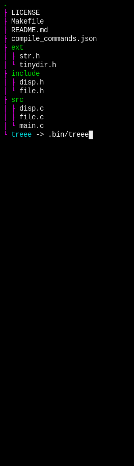
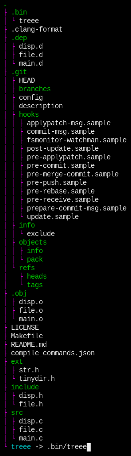

# treee

treee is an interactive GNU/Linux `tree` clone.

_This project is in a very early stage of development, but basic features are complete._

## Purpose

I have found `tree` to be a really great addition to development.

This program is similar to `tree` but is built with ncurses;
the working directory is scanned every second and updates the display.

## Example




## Usage

```bash
git clone https://github.com/jpcx/treee
cd treee
make
sudo make install

treee

# for other directories:
treee ../another_dir
```

## Controls

`h`, `j`, `k`, `l` for motion

_[hold shift for fast motion]_

press `.` to toggle hidden file display

pres `q` to exit

## TODO

- color different file types differently
- add `/` control for search
- add more command parameters
  - enable/disable colors
  - exclude matching
- display more directory information

## Contribution

Contribution is welcome! Again, this is in an early stage of development.
