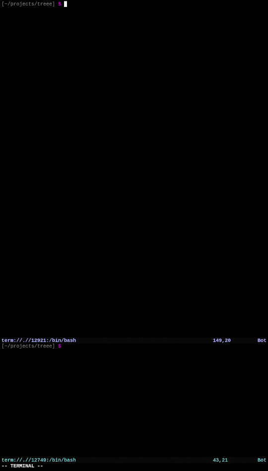

# [treee](CHANGELOG.md)

```
 _
| |_ _ __ ___  ___  ___   treee: an interactive file tree viewer
| __| '__/ _ \/ _ \/ _ \  Copyright (C) 2020-2023 Justin Collier
| |_| | |  __/  __/  __/
 \__|_|  \___|\___|\___|  - - - - - - - - - - - - - - - - - -
```

## About

treee is intended for use as an auxiliary window for software development.  
Use it to keep track of the relevant parts of your project structure.

treee  
- provides a live view of any number of directory trees
- links with libgit2 to skip gitignored paths for each tree
- allows for manual pattern match exclusions
- skips hidden files by default



## Requirements

- GNU/Linux
- \>= C++17 (tested with Clang 10.0.0, Clang 12.0.0, GCC 10.2.1, and GCC 11.0.0)
- libgit2 [optional; compile with `cmake .. -DTREEE_NO_GIT=ON` to disable]
- ncurses
- pthread
- CMake >=3.0
- GNU Make [optional; Makefile calls CMake]

## Usage

```bash
git clone https://github.com/jpcx/treee
cd treee
make
sudo make install

# for this directory
treee

# for other directories:
treee ../another_dir

# for multiple directories:
treee . some_dir ../another_dir

# to exclude patterns (ECMAScript Regex)
treee -I thirdparty|assets

# to set a max descent level
treee -L 3
```

## Controls

`h`, `j`, `k`, `l` for motion

_[hold shift for fast motion]_

press `.` to toggle hidden file display  
press `g` to toggle gitignored file display  
press `i` to toggle pattern-ignored file display  
press `+` to increase descent level
press `-` to decrease descent level

press `q` to exit

## TODO

- improve colors; vary according to file type
- improve multithreading mutex efficiency
- extend to Windows; provide replacement for -lpthread

## Contribution

Contribution is welcome! Please make a pull request.

## [License](LICENSE)

```
Copyright (C) 2020-2023 Justin Collier

  This program is free software: you can redistribute it and/or modify
  it under the terms of the GNU General Public License as published by
  the Free Software Foundation, either version 3 of the License, or
  (at your option) any later version.

  This program is distributed in the hope that it will be useful,
  but WITHOUT ANY WARRANTY; without even the implied warranty of
  MERCHANTABILITY or FITNESS FOR A PARTICULAR PURPOSE.  See the
  GNU General Public License for more details.

You should have received a copy of the GNU General Public License
along with this program.  If not, see <https://www.gnu.org/licenses/>.
```
